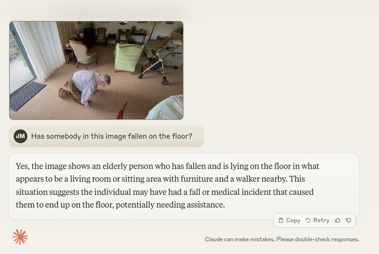
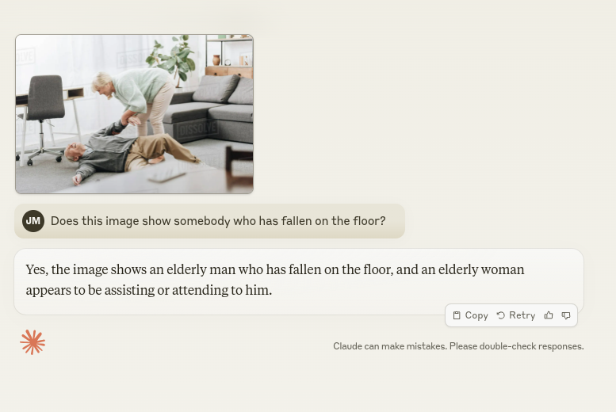

# fall-detection

## Setup

1. `python3.12 -m venv .venv/`
2. `source .venv/bin/activate`

## Report

### Experiment A: Claude Sonnet Multi Modal

Both test images were applied to [Claude's Sonnet Model](https://claude.ai/chat/) using the prompt "Has somebody in this image fallen on the floor".

Using a Multi Modal AI like Claude, GPT4-V or other variants (closed or open source) shows the capability of detecting falls in a still frame of an image. This approach may not be possible if the BT/UU device cannot make API requests, or if cost limitations are in place, but this could mitigated by checking for falls once every 30 seconds or other reasonable cost saving frequency. 

### Experiment B: Floor Detection Using OpenCV

This approach would involve the detection of the floor, THEN determining the pose key points positioning in relation to the floor.

### Experiment C: Using Stereoscopic Camera Depth Information

N/A - Pending Testing.

### Experiment D: Pose Key-points Positioning

Regardless of floor position, is it possible to use the pose key point coordinates and and draw a plane/line from the head point to any given foot point to determine if the individual is in a prone position.

### Experiment E: YOLO Pretrained Model

https://universe.roboflow.com/savelyzh-bn3gq/floor-detection-btxc3

This model implies it is possible to train a model using YOLO on floors, if it can be used openly or if the dataset exists and is labelled. 

### Experiment F: CNN

https://ietresearch.onlinelibrary.wiley.com/doi/full/10.1049/ipr2.12667

### Experiment G: Fall based on head and foot coordinate change speed

https://github.com/kasakun/Fall-Detection/blob/master/Detection/falldetect2.5.py

### Experiment H: People detector + orientation of bounding box

A decent idea, but does not perform well using a basic HOG approach.

### Others - For inspiration!

- https://github.com/GajuuzZ/Human-Falling-Detect-Tracks
- https://towardsdatascience.com/fall-detection-using-pose-estimation-a8f7fd77081d
    - Contains a dataset link and some interesting ideas.
    - https://github.com/cwlroda/falldetection_openpifpaf
- https://github.com/taufeeque9/HumanFallDetection
    - Links a dataset and references an LSTM approach.
- https://sites.google.com/up.edu.mx/har-up/
- Useful ideas in this about spinal vectors:
    - https://github.com/ambianic/fall-detection
    - Uses a different pose algo, but fall algo could be ported and applied to BT/UU.
        

